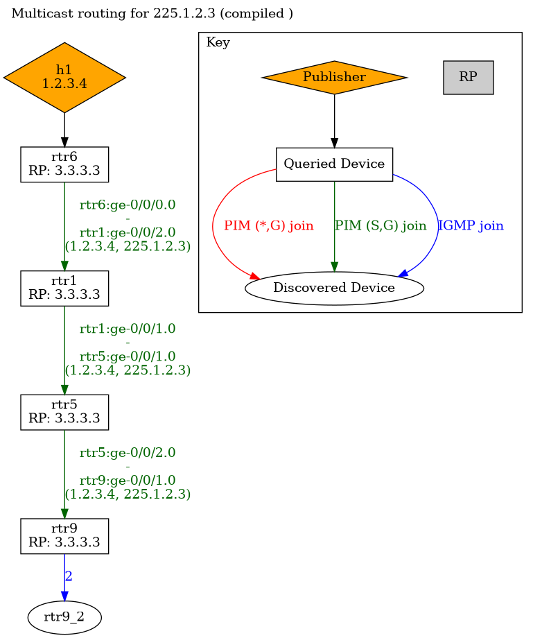

# OSPF pentagram

## Topology

```
                  .-----.
                  |rtr10|
                  '-----'
                   /   \
.--.  .----.  .----.  .----.  .----.  .--.
|h1|--|rtr6|--|rtr1|--|rtr5|--|rtr9|--|h2|
'--'  '----'  '----'  '----'  '----'  '--'
SRC       \.----./      \.----./      RECV
           |rtr2|        |rtr4|
           '----'\.----./'----'
             /    |rtr3|    \
          .----.--'----'--.----.
          |rtr7|    RP    |rtr8|
          '----'          '----'
```

## Suzieq notes

### RPT

In certain cases core ring is fully traversed in the Root Path Tree to reach the Rendesvouz Point.

```
suzieq> route show protocol=pim prefixlen='64'
      namespace hostname   vrf                prefix nexthopIps oifs protocol source  preference  ipvers                      action
0  mcast_sparse     rtr1  inet  225.1.2.3,1.2.3.4/64         []   []      pim                105       0  multicast (ipv4) composite
1  mcast_sparse     rtr2  inet  225.1.2.3,1.2.3.4/64         []   []      pim                105       0  multicast (ipv4) composite
2  mcast_sparse     rtr3  inet  225.1.2.3,1.2.3.4/64         []   []      pim                105       0  multicast (ipv4) composite
3  mcast_sparse     rtr4  inet  225.1.2.3,1.2.3.4/64         []   []      pim                105       0  multicast (ipv4) composite
4  mcast_sparse     rtr5  inet  225.1.2.3,1.2.3.4/64         []   []      pim                105       0  multicast (ipv4) composite
5  mcast_sparse     rtr6  inet  225.1.2.3,1.2.3.4/64         []   []      pim                105       0  multicast (ipv4) composite
6  mcast_sparse     rtr9  inet  225.1.2.3,1.2.3.4/64         []   []      pim                105       0  multicast (ipv4) composite
```

### SPT

```
suzieq> route show protocol=pim prefixlen='64'
      namespace hostname   vrf                prefix nexthopIps oifs protocol source  preference  ipvers                      action
0  mcast_sparse     rtr1  inet  225.1.2.3,1.2.3.4/64         []   []      pim                105       0  multicast (ipv4) composite
1  mcast_sparse     rtr5  inet  225.1.2.3,1.2.3.4/64         []   []      pim                105       0  multicast (ipv4) composite
2  mcast_sparse     rtr6  inet  225.1.2.3,1.2.3.4/64         []   []      pim                105       0  multicast (ipv4) composite
3  mcast_sparse     rtr9  inet  225.1.2.3,1.2.3.4/64         []   []      pim                105       0  multicast (ipv4) composite
```

Plotting a graph for the Sortest Path Tree:


